<h1 align="center"> PROYECTO FASE 1 </h1>

  

*Universidad de San Carlos de Guatemala*  
*Escuela de Ingeniería en Ciencias y Sistemas, Facultad de Ingenieria*  
*Laboratorio de Software Avanzado Sección A, 1er. Semestre 2025.*  
___

### **Resumen**
Durante la primera fase del desarrollo del proyecto Swaptify se construyeron las bases funcionales de una plataforma de comercio electrónico, centrada en la experiencia del usuario y la gestión de productos. Se habilitó la posibilidad de explorar el catálogo de productos sin necesidad de estar registrado; sin embargo, para realizar transacciones, los usuarios deben crear una cuenta. El proceso de registro solicita información personal detallada, como nombre, correo, dirección y fecha de nacimiento, e incluye un sistema de verificación por correo electrónico con tiempo limitado de validez. Además, se implementó una sección de perfil donde el usuario puede modificar sus datos personales y gestionar múltiples direcciones. El acceso a la plataforma se asegura mediante credenciales seguras, permitiendo iniciar sesión con correo o nombre de usuario y contraseña.

También se estableció el sistema de control de usuarios, el cual otorga a los administradores la capacidad de gestionar las cuentas registradas. Esto incluye la activación o desactivación de usuarios, así como la creación manual de cuentas para casos especiales. Adicionalmente, los administradores pueden gestionar promociones y realizar seguimiento a usuarios reportados por malas prácticas, aunque algunas de estas funciones se reservan para futuras fases.

En cuanto al manejo de productos, se desarrolló la funcionalidad para que los mismos usuarios carguen productos al sistema, proporcionando atributos clave como categoría, precio, descripción, imágenes, restricciones de venta y disponibilidad. Esta información se almacena y estructura adecuadamente para su despliegue dentro del catálogo. Finalmente, se creó un catálogo navegable que organiza los productos por secciones como más vendidos, ofertas, categorías, marcas, y recomendaciones personalizadas basadas en el historial de navegación y compras, mejorando así la experiencia de búsqueda y compra dentro de la plataforma.

___
### **Requisitos** 
#### 💪 Funcionales

**RF-01.** El sistema debe permitir a los usuarios no registrados visualizar el catálogo de productos sin restricciones.

**RF-02.** El sistema debe permitir el registro de nuevos usuarios solicitando los siguientes datos: ID, nombre, apellido, correo, username, teléfono, dirección (con ciudad y departamento), fecha de nacimiento, sexo y foto (opcional).

**RF-03.** Tras el registro, el sistema debe enviar automáticamente un correo de verificación con una validez de 2 minutos, sin el cual el usuario no podrá acceder.

**RF-04.** El sistema debe permitir a los usuarios iniciar sesión utilizando su correo o nombre de usuario y su contraseña, garantizando un acceso seguro.

**RF-05.** El sistema debe permitir a los usuarios registrados editar su información personal desde la sección "Mi Perfil", incluyendo correo electrónico, teléfono y direcciones (pudiendo tener más de una).

**RF-06.** El sistema debe contar con un rol de administrador con la capacidad de activar o desactivar cuentas de usuario según sea necesario.

**RF-07.** El sistema debe permitir al administrador crear cuentas de usuario de forma manual para casos especiales.

**RF-08.** El sistema debe permitir al administrador gestionar promociones y descuentos aplicables a los usuarios (aunque esta funcionalidad puede implementarse parcialmente en esta fase).

**RF-09.** El sistema debe permitir a los usuarios cargar productos, incluyendo información como ID, categoría, marca(s), restricciones de venta, precio, descripción, imágenes, código, valor, disponibilidad y otros atributos opcionales.

**RF-10.** El sistema debe permitir explorar el catálogo de productos a través de múltiples criterios: más vendidos, ofertas, categoría, marca, calificación, nuevos productos, rebajas de temporada, rango de precio y recomendaciones.

**RF-11.** El sistema debe generar recomendaciones personalizadas para los usuarios en función de su historial de navegación y compras anteriores.

#### ⭐ No Funcionales
RNF-01. Contenerización y orquestación:
Cada microservicio debe ejecutarse dentro de un contenedor Docker, y su orquestación debe gestionarse a través de Kubernetes.

RNF-02. Seguridad en autenticación y acceso:
El sistema debe implementar mecanismos de autenticación seguros (por ejemplo, almacenamiento cifrado de contraseñas, uso de HTTPS) para proteger la información del usuario.

RNF-03. Escalabilidad:
El sistema debe ser capaz de escalar horizontalmente los microservicios según la demanda del tráfico mediante la gestión automática de Kubernetes.

RNF-04. Disponibilidad y resiliencia:
El sistema debe ser tolerante a fallos parciales y mantener la disponibilidad general ante la caída de algún servicio individual.

RNF-05. Interfaz intuitiva y atractiva:
La plataforma debe contar con una interfaz gráfica que sea visualmente atractiva, fácil de navegar y accesible desde dispositivos modernos.

RNF-06. Tiempo de respuesta aceptable:
Las operaciones más comunes (como navegación, registro, login y carga de productos) deben ejecutarse con tiempos de respuesta menores a 2 segundos bajo condiciones normales de carga.

RNF-07. Compatibilidad y portabilidad:
El sistema debe funcionar correctamente en los principales navegadores web modernos (Chrome, Firefox, Edge) y en diferentes sistemas operativos.
___  
### **Funcionalidades**
**RF-01**

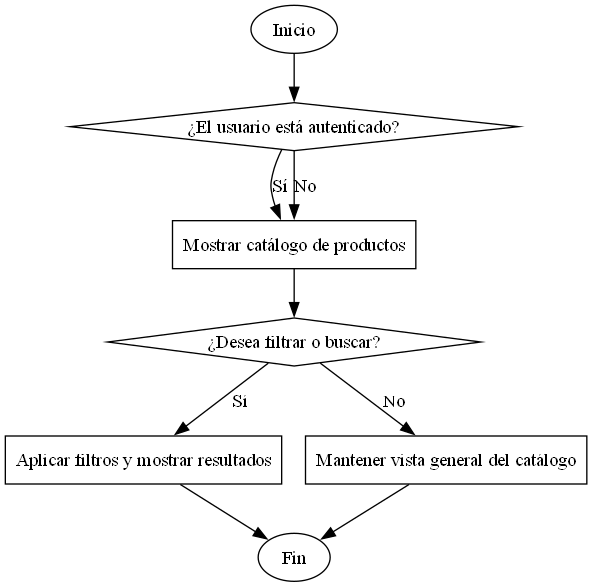

**RF-02**

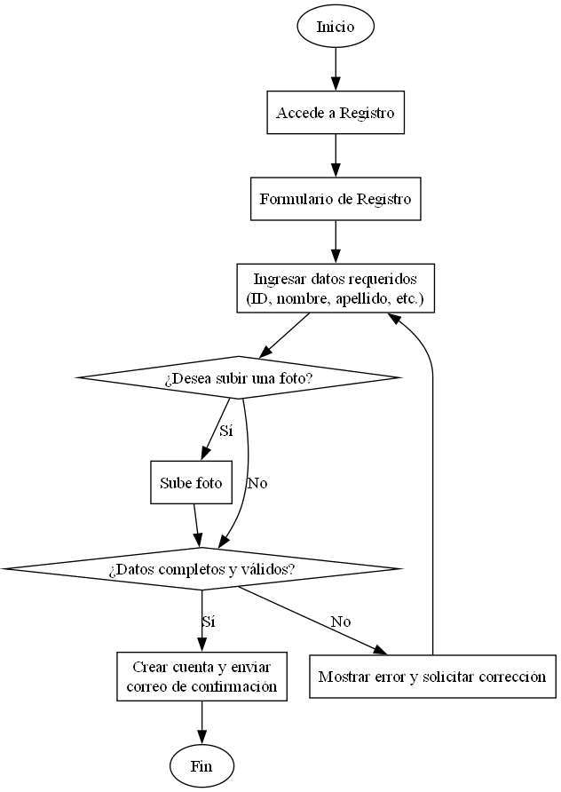

**RF-03**

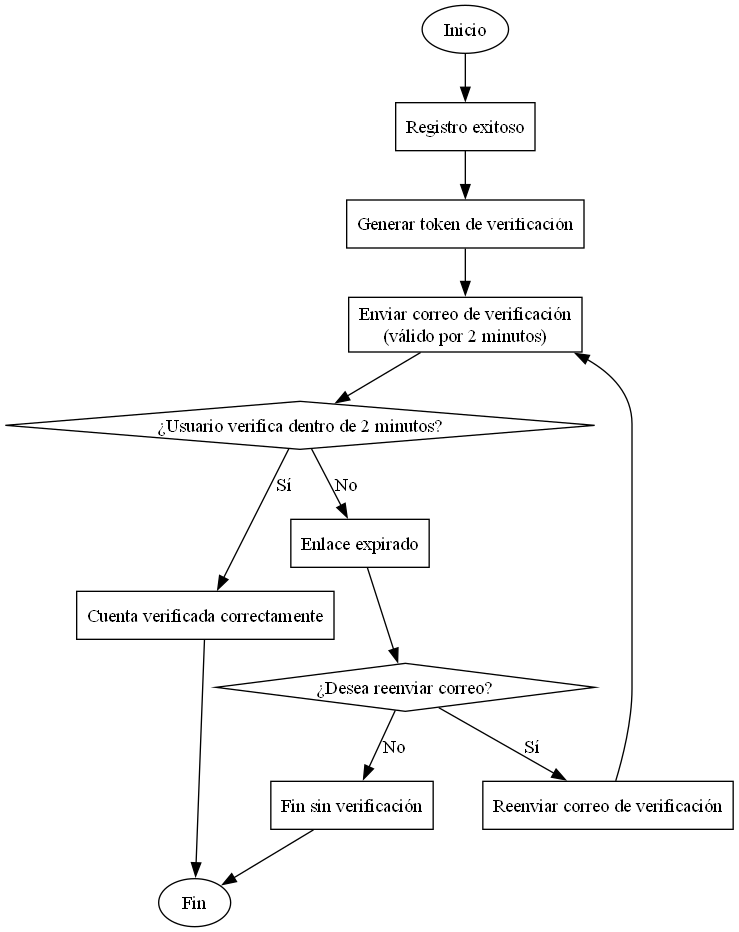

**RF-04**

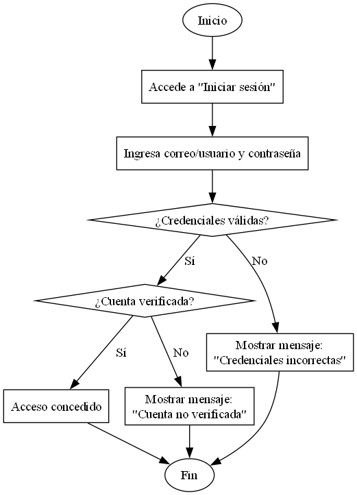

**RF-05**

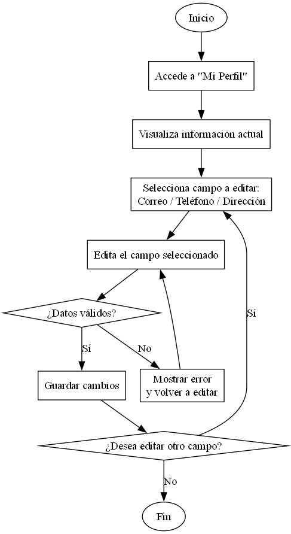

**RF-06**

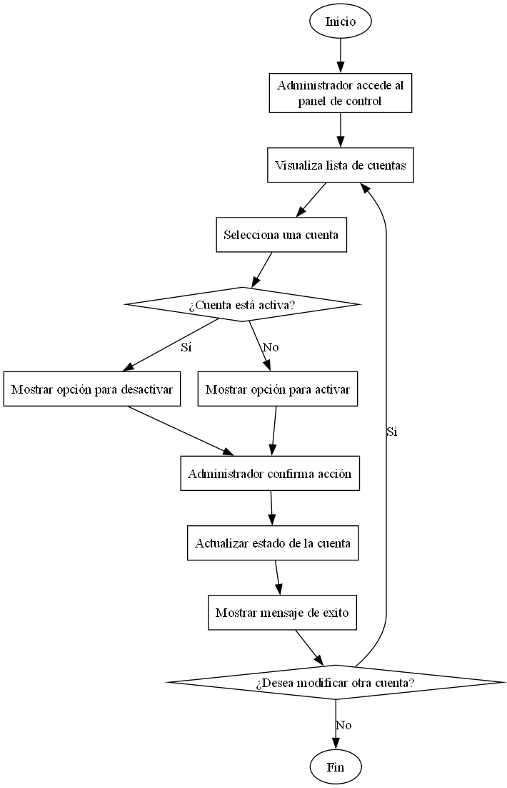

**RF-07**

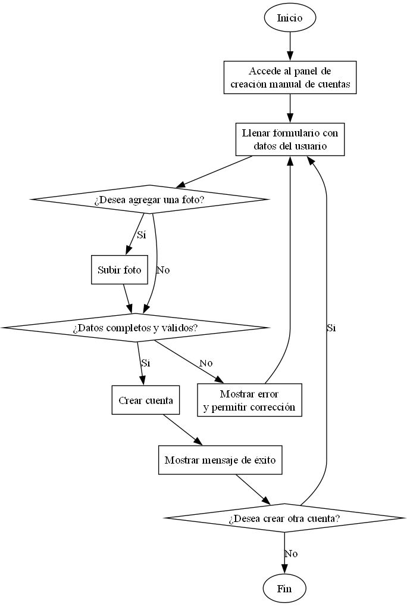

**RF-08**

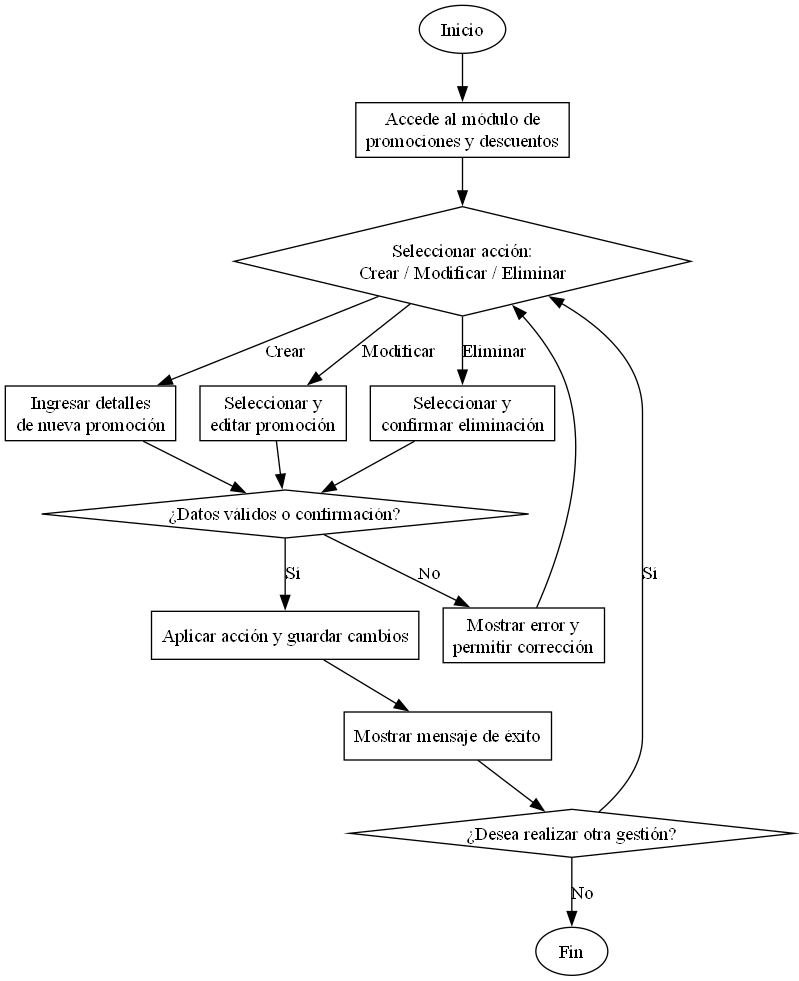

**RF-09**

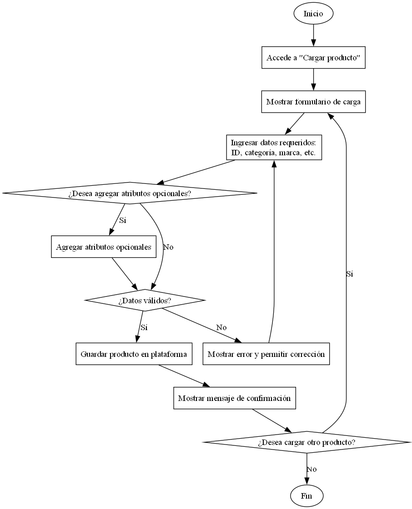

**RF-10**

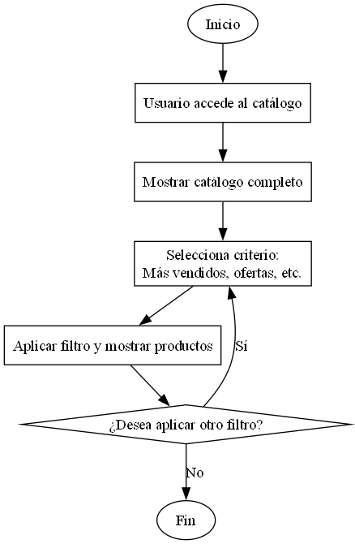

**RF-11**

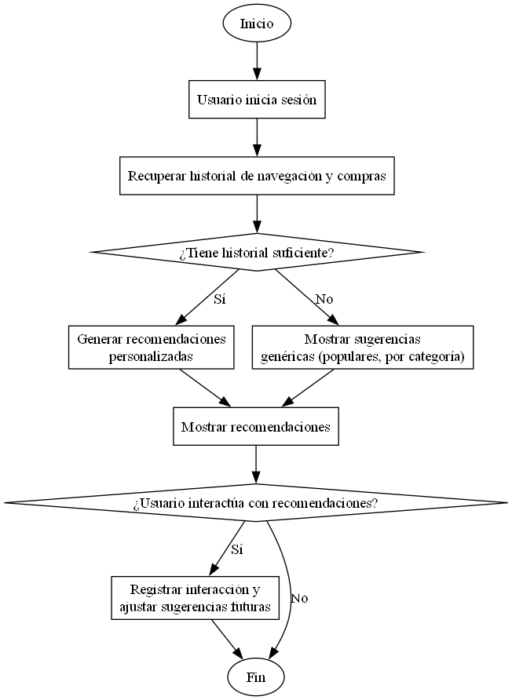

___
### **Diagrama de Alto Nivel**
### **Casos De Uso**
|ID   |Nombre                                 |Actor Principal      |Descripción                                                                                                            |
|-----|---------------------------------------|---------------------|-----------------------------------------------------------------------------------------------------------------------|
|CU-01|Visualizar catálogo sin registrarse    |Usuario no registrado|Permite a los visitantes ver el catálogo completo de productos sin necesidad de iniciar sesión.                        |
|CU-02|Registrar nuevo usuario                |Usuario              |Permite a un usuario crear una cuenta ingresando los datos solicitados.                                                |
|CU-03|Confirmar correo tras registro         |Sistema              |Envía un correo de confirmación tras el registro. El usuario debe validarlo dentro de 2 minutos para activar su cuenta.|
|CU-04|Iniciar sesión                         |Usuario              |Permite a los usuarios acceder con su correo o nombre de usuario y contraseña.                                         |
|CU-05|Editar perfil de usuario               |Usuario registrado   |Permite modificar información personal desde la sección 'Mi Perfil'.                                                   |
|CU-06|Activar o desactivar cuentas de usuario|Administrador        |Permite al administrador habilitar o bloquear cuentas según necesidad.                                                 |
|CU-07|Crear cuenta manualmente               |Administrador        |Permite al administrador registrar usuarios directamente para casos especiales.                                        |
|CU-08|Gestionar promociones y descuentos     |Administrador        |Permite crear, modificar o eliminar promociones y descuentos para los usuarios.                                        |
|CU-09|Cargar producto                        |Usuario autorizado   |Permite a los usuarios subir productos con todos los datos requeridos y opcionales.                                    |
|CU-10|Explorar catálogo por criterios        |Usuario              |Permite buscar productos según categorías como más vendidos, rebajas, marcas, etc.                                     |
|CU-11|Recomendaciones personalizadas         |Sistema              |El sistema sugiere productos con base en el historial de navegación y compras del usuario.                             |

### **Diagramas de Casos De Uso**
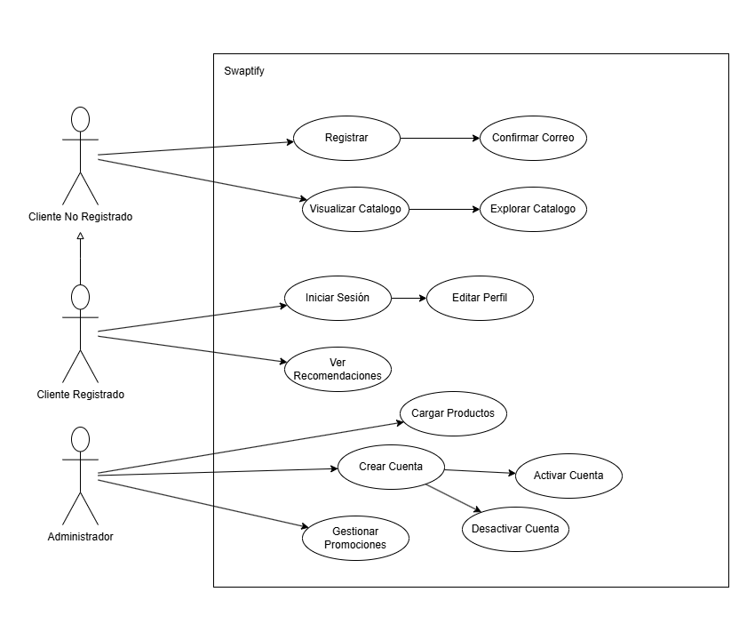

**Inicio Público y Catálogo**

| **Visualizar catálogo sin registrarse** | |
| --- | --- |
| Tipo | Primario |
| Actores | Usuario no registrado |
| Descripción | Permite a cualquier visitante navegar el catálogo de productos sin necesidad de estar registrado en la plataforma. |

| **Explorar catálogo por criterios** | |
| --- | --- |
| Tipo | Primario |
| Actores | Usuario, Administrador |
| Descripción | Permite buscar productos por categorías como más vendidos, rebajas, nuevos productos, precio, marca, etc. |

| **Ver recomendaciones personalizadas** | |
| --- | --- |
| Tipo | Secundario |
| Actores | Sistema |
| Descripción | Genera y muestra sugerencias de productos al usuario en base a su historial de compras y navegación. |

**Registro e Inicio de Sesión**

| **Registro de Usuarios** | |
| --- | --- |
| Tipo | Primario |
| Actores | Usuario |
| Descripción | Permite a nuevos usuarios registrarse proporcionando datos como nombre, correo, dirección, teléfono, etc. |

| **Confirmación por correo electrónico** | |
| --- | --- |
| Tipo | Secundario |
| Actores | Usuario, Sistema |
| Descripción | El sistema envía un correo de verificación que debe ser confirmado en un tiempo limitado para activar la cuenta. |

| **Inicio de Sesión** | |
| --- | --- |
| Tipo | Primario |
| Actores | Usuario |
| Descripción | Permite al usuario ingresar al sistema mediante correo o nombre de usuario y contraseña. |

**Gestión del Perfil**

| **Gestión de perfil de usuario** | |
| --- | --- |
| Tipo | Primario |
| Actores | Usuario registrado |
| Descripción | Permite a los usuarios modificar su información personal como correo, teléfono y direcciones. |

**Administrador**

| **Activar o desactivar cuentas** | |
| --- | --- |
| Tipo | Primario |
| Actores | Administrador |
| Descripción | Permite al administrador habilitar o bloquear cuentas de usuarios según sea necesario. |

| **Crear cuentas especiales** | |
| --- | --- |
| Tipo | Secundario |
| Actores | Administrador |
| Descripción | Permite al administrador crear cuentas manualmente para usuarios en casos específicos. |

| **Gestionar promociones y descuentos** | |
| --- | --- |
| Tipo | Secundario |
| Actores | Administrador |
| Descripción | Permite al administrador crear, editar y eliminar promociones o descuentos dentro de la plataforma. |

**Carga de Productos**

| **Carga de productos por usuario** | |
| --- | --- |
| Tipo | Primario |
| Actores | Usuario registrado (con permisos), Administrador |
| Descripción | Permite a los usuarios cargar productos con información como categoría, marca, precio, imágenes, etc. para que aparezcan en el catálogo. |

### **Metodología Ágil Utilizada**

#### 📌 Metodología: **Scrum**
Para esta fase se aplicó la metodología ágil **Scrum**, la cual divide el desarrollo en ciclos iterativos llamados **sprints**, de duración fija. Se trabajó con planificación anticipada, asignación de tareas, revisión continua del progreso mediante un tablero Kanban y reuniones de retroalimentación al final de cada sprint para ajustar el rumbo del desarrollo.

#### 📋 Backlog del Proyecto
Puedes presentar el backlog como una tabla simple (o tarjeta de Trello) con todas las funcionalidades o historias de usuario que quieres implementar:

| ID | Historia de Usuario | Prioridad | Estimación |
|----|---------------------|-----------|------------|
| HU-01 | Como usuario no registrado, quiero ver productos sin cuenta | Alta | 1 día |
| HU-02 | Como usuario, quiero registrarme | Alta | 1 día |
| HU-03 | Como usuario, quiero confirmar mi cuenta por correo | Alta | 0.5 días |
| HU-04 | Como usuario, quiero iniciar sesión | Alta | 1 día |
| HU-05 | Como usuario, quiero editar mi perfil | Media | 1 día |
| HU-06 | Como admin, quiero activar/desactivar cuentas | Alta | 1 día |
| HU-07 | Como admin, quiero crear cuentas especiales | Media | 0.5 días |
| HU-08 | Como admin, quiero gestionar promociones | Media | 1 día |
| HU-09 | Como usuario, quiero cargar productos | Alta | 1.5 días |
| HU-10 | Como usuario, quiero explorar catálogo por criterios | Alta | 1 día |
| HU-11 | Como sistema, quiero recomendar productos | Media | 1 día |

#### 🔁 División en sprints

Sprint 1 (Semana 1):
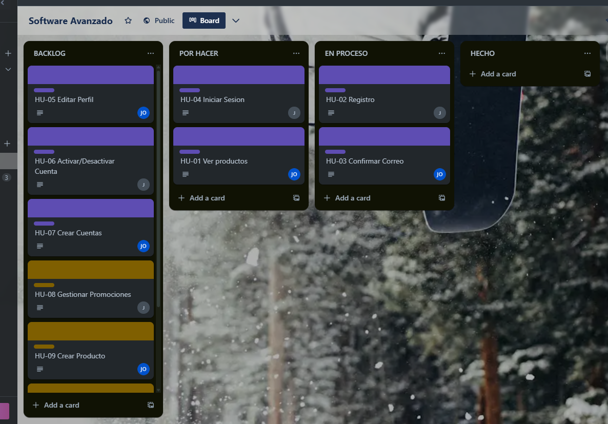
Sprint 1 (Semana 2):
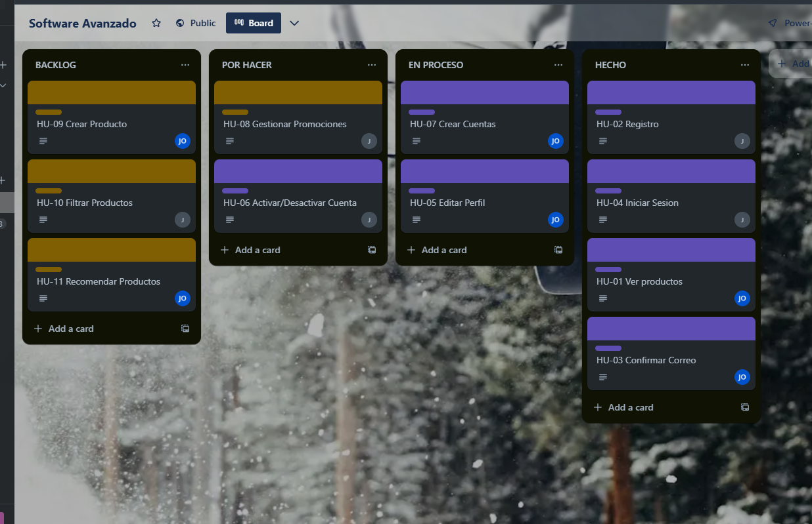
Sprint 1 (Semana 3):
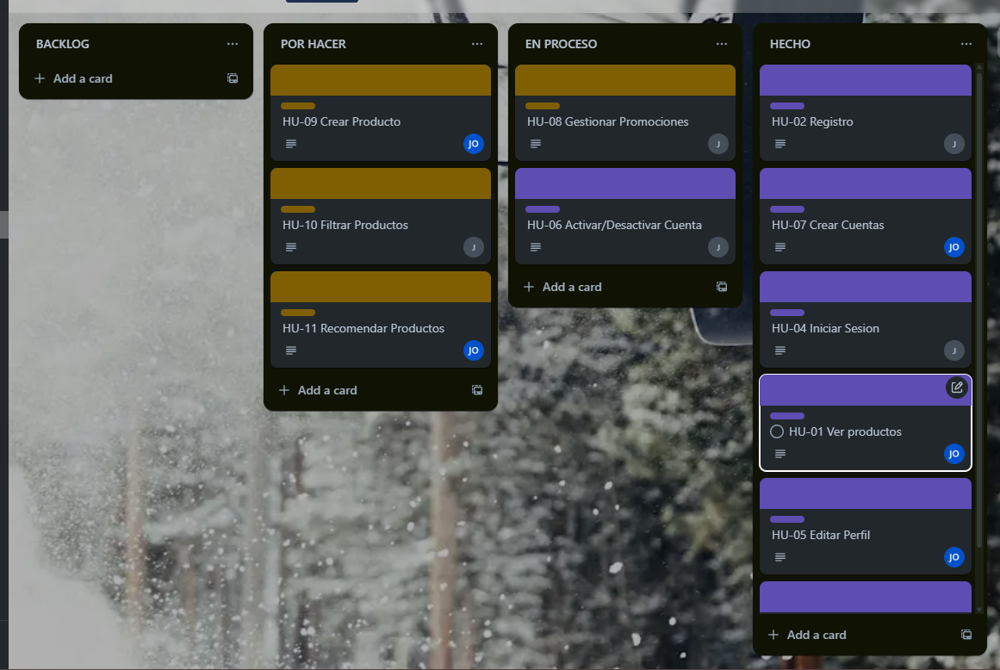

### Diagrama Arquitectura

### Diagrama ER de los microservicios

1. Auth-Service

2. Product-Service

