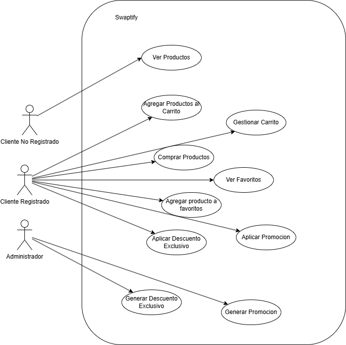
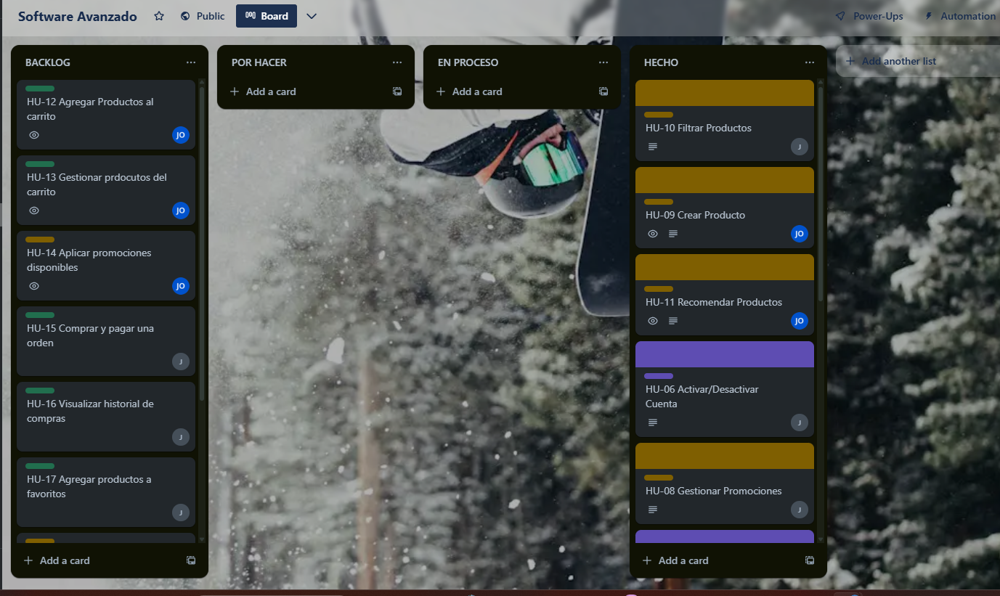
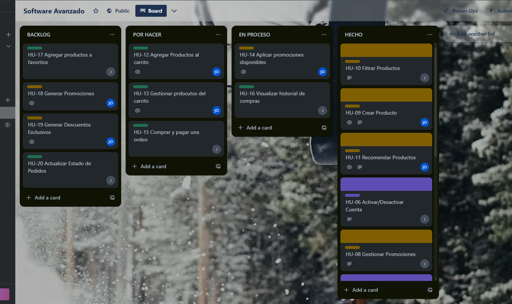
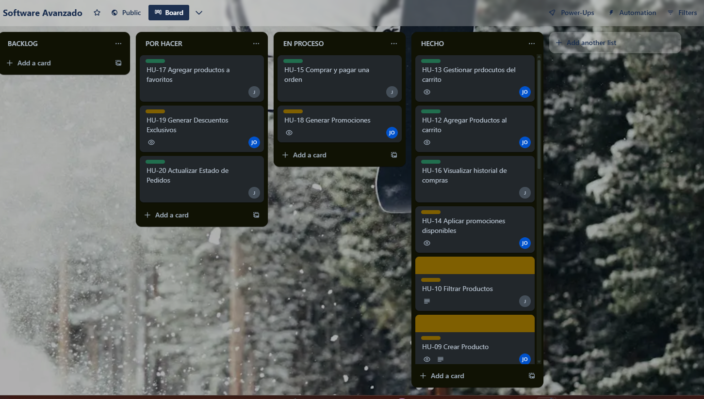
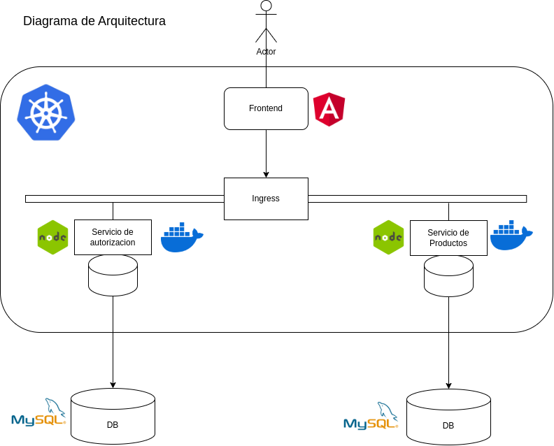

<h1 align="center"> PROYECTO FASE 2 </h1>

  

*Universidad de San Carlos de Guatemala*  
*Escuela de Ingeniería en Ciencias y Sistemas, Facultad de Ingenieria*  
*Laboratorio de Software Avanzado Sección A, 1er. Semestre 2025.*  
___

### **Requisitos** 
#### 💪 Funcionales
Descuento Exclusivo
RF-01. El sistema debe llevar el registro del monto acumulado de compras de cada usuario.

RF-02. Cuando un usuario acumule Q10,000 o más en compras, el sistema debe habilitar automáticamente la opción de aplicar un descuento exclusivo en su siguiente compra.

RF-03. El descuento aplicable debe ser el siguiente:

De Q10,000 a Q12,999: 5%

De Q13,000 a Q16,999: 10%

De Q17,000 en adelante: 20%

RF-04. El descuento debe aplicarse automáticamente al total de la compra si el usuario decide activarlo.

RF-05. El descuento exclusivo solo podrá utilizarse una vez por usuario.

RF-06. El descuento tendrá una vigencia de 30 días a partir del momento en que el usuario supere los Q10,000 acumulados.

RF-07. El descuento no es acumulable con otras promociones ni aplicable a productos ya rebajados.

RF-08. El sistema debe enviar una notificación automática (correo electrónico y/o notificación push) al usuario cuando el descuento esté disponible.

Historial de Compras
RF-09. El sistema debe almacenar el historial de compras de cada usuario.

RF-10. El usuario podrá visualizar sus compras anteriores desde su perfil.

RF-11. El historial podrá ser ordenado por:

Fecha de compra

Precio de compra

Calificación de productos

RF-12. El usuario podrá ver su monto total de compras acumuladas filtrado por:

Últimos 30 días

Últimos 6 meses

Últimos 12 meses

Histórico total

RF-13. El monto total acumulado debe estar disponible en su perfil o en una sección especial del sistema.

Mis Favoritos
RF-14. El sistema debe permitir que los usuarios agreguen productos a una lista de favoritos.

RF-15. Los usuarios podrán comprar productos directamente desde su lista de favoritos.

RF-16. El sistema debe actualizar automáticamente los precios de los productos en favoritos según la región y promociones disponibles.

RF-17. El sistema debe notificar automáticamente al usuario si:

El precio de un producto en favoritos baja.

El stock de un producto en favoritos está por agotarse.

Carrito de Compras y Descuentos
RF-18. El usuario podrá agregar productos al carrito de compras.

RF-19. El usuario podrá eliminar productos del carrito.

RF-20. El usuario podrá modificar la cantidad de productos en el carrito.

RF-21. El carrito debe mostrar: El total de la compra incluyendo impuestos. El costo de envío.

RF-22. El sistema debe aplicar automáticamente promociones y descuentos disponibles a los productos en el carrito.

RF-23. El sistema debe manejar descuentos exclusivos por temporada o por monto de compra.

RF-24. El usuario podrá seleccionar métodos de pago seguros (tarjeta de crédito o débito).

RF-25. Al completar una compra, el sistema debe enviar un correo de confirmación con el resumen de la compra.

RF-26. El usuario podrá dar seguimiento a su pedido en tiempo real desde su perfil.

#### ⭐ No Funcionales

RNF-01. Seguridad:
El sistema debe implementar mecanismos seguros para el manejo de credenciales de usuario, incluyendo:

Cifrado de contraseñas (por ejemplo, mediante bcrypt).

Uso de HTTPS en todas las comunicaciones.

RNF-02. Disponibilidad:
La plataforma debe estar disponible al menos el 99% del tiempo para los usuarios.

RNF-03. Escalabilidad:
El sistema debe ser escalable para soportar incrementos de usuarios y transacciones, utilizando contenedores Docker y orquestación mediante Kubernetes.

RNF-04. Tiempo de Respuesta:
El tiempo de respuesta para cargar las principales páginas (catálogo, carrito, historial de compras) debe ser menor a 2 segundos bajo carga normal.

RNF-05. Compatibilidad:
La plataforma debe ser accesible desde:

Navegadores web modernos (Chrome, Firefox, Edge, Safari).

Dispositivos móviles (responsive design).

RNF-06. Mantenibilidad:
El sistema debe seguir una arquitectura de microservicios, con separación clara de responsabilidades para facilitar actualizaciones, pruebas y mantenimiento.

RNF-07. Notificaciones:
Las notificaciones automáticas (correo electrónico y push) deben enviarse utilizando servicios confiables, con un tiempo máximo de entrega de 5 minutos tras la generación del evento.

RNF-08. Monitoreo:
El sistema debe contar con herramientas de monitoreo y alerta (como Prometheus y Grafana) para supervisar:

Consumo de recursos (CPU, RAM).

Disponibilidad de servicios.

Errores de la aplicación.

RNF-09. Recuperación ante Fallos:
El sistema debe permitir la recuperación automática ante fallos mediante la recreación de contenedores fallidos en Kubernetes.

RNF-10. Pruebas:
Se deben realizar pruebas automatizadas para garantizar:

La correcta aplicación de descuentos.

La gestión del historial de compras.

La funcionalidad del carrito y favoritos.

RNF-11. Vigencia del Descuento Exclusivo:
El descuento exclusivo debe expirar automáticamente 30 días después de ser habilitado, independientemente del estado del usuario.

RNF-12. Protección de Datos:
Se deben cumplir buenas prácticas de protección de datos personales, asegurando que la información de los usuarios no sea expuesta ni compartida con terceros sin autorización.

RNF-13. Integridad de la Información:
Todas las transacciones (compras, acumulación de montos, activación de descuentos) deben ser registradas de manera consistente y a prueba de fallos.

### **Diagrama de Alto Nivel**
### **Casos De Uso**
ID | Nombre | Actor Principal | Descripción
CU-12 | Agregar producto al carrito | Usuario registrado | Permite al usuario agregar productos disponibles a su carrito de compras.
CU-13 | Gestionar carrito | Usuario registrado | Permite al usuario eliminar productos o modificar la cantidad de productos en su carrito.
CU-14 | Aplicar promociones automáticas | Sistema | El sistema detecta y aplica automáticamente promociones y descuentos disponibles al carrito.
CU-15 | Realizar compra y pago seguro | Usuario registrado | Permite al usuario completar su compra utilizando métodos de pago seguros.
CU-16 | Recibir confirmación de compra | Sistema | Envía un correo de confirmación con el resumen de la compra realizada.
CU-17 | Visualizar historial de compras | Usuario registrado | Permite al usuario consultar todas sus compras anteriores y el monto total acumulado.
CU-18 | Ordenar historial de compras | Usuario registrado | Permite ordenar el historial de compras por fecha, precio o calificación.
CU-19 | Agregar producto a favoritos | Usuario registrado | Permite al usuario agregar productos a una lista de favoritos para futura compra rápida.
CU-20 | Visualizar productos favoritos | Usuario registrado | Permite al usuario consultar su lista de productos favoritos actualizada por región y promociones.
CU-21 | Recibir notificaciones de favoritos | Sistema | Envía una notificación si baja el precio o el stock de un producto en la lista de favoritos.
CU-22 | Activar descuento exclusivo | Usuario registrado | Permite al usuario aplicar su descuento exclusivo en su compra si cumple las condiciones.
CU-23 | Notificar disponibilidad de descuento | Sistema | Envía una notificación automática al usuario cuando un descuento exclusivo está disponible.

### **Diagramas de Casos De Uso**

### **Carrito de Compras**

| **Agregar producto al carrito** | |
| --- | --- |
| Tipo | Primario |
| Actores | Usuario registrado |
| Descripción | Permite al usuario agregar productos disponibles a su carrito de compras para su posterior compra. |

| **Gestionar carrito de compras** | |
| --- | --- |
| Tipo | Primario |
| Actores | Usuario registrado |
| Descripción | Permite al usuario eliminar productos del carrito o modificar la cantidad de unidades de los productos agregados. |

| **Aplicar promociones automáticas** | |
| --- | --- |
| Tipo | Secundario |
| Actores | Sistema |
| Descripción | El sistema detecta y aplica automáticamente promociones o descuentos válidos a los productos del carrito. |

---

### **Proceso de Compra**

| **Realizar compra y pago seguro** | |
| --- | --- |
| Tipo | Primario |
| Actores | Usuario registrado |
| Descripción | Permite al usuario confirmar su compra, seleccionar el método de pago y completar la transacción de forma segura. |

| **Enviar confirmación de compra** | |
| --- | --- |
| Tipo | Secundario |
| Actores | Sistema |
| Descripción | El sistema envía un correo electrónico al usuario con el resumen y detalles de su compra realizada. |

---

### **Historial de Compras**

| **Visualizar historial de compras** | |
| --- | --- |
| Tipo | Primario |
| Actores | Usuario registrado |
| Descripción | Permite al usuario consultar todas las compras anteriores realizadas en la plataforma. |

| **Ordenar historial de compras** | |
| --- | --- |
| Tipo | Secundario |
| Actores | Usuario registrado |
| Descripción | Permite al usuario ordenar su historial por fecha, precio o calificación de los productos adquiridos. |

---

### **Favoritos**

| **Agregar producto a favoritos** | |
| --- | --- |
| Tipo | Primario |
| Actores | Usuario registrado |
| Descripción | Permite al usuario agregar productos a una lista de favoritos para facilitar compras futuras. |

| **Visualizar productos favoritos** | |
| --- | --- |
| Tipo | Primario |
| Actores | Usuario registrado |
| Descripción | Permite al usuario ver su lista de productos favoritos con información actualizada de precio y disponibilidad. |

| **Notificación de cambios en favoritos** | |
| --- | --- |
| Tipo | Secundario |
| Actores | Sistema |
| Descripción | El sistema notifica automáticamente al usuario cuando el precio baja o el stock de un producto favorito está por agotarse. |

---

### **Descuento Exclusivo**

| **Aplicar descuento exclusivo** | |
| --- | --- |
| Tipo | Primario |
| Actores | Usuario registrado |
| Descripción | Permite al usuario aplicar un descuento exclusivo en su compra si cumple con las condiciones de monto acumulado. |

| **Notificación de disponibilidad de descuento exclusivo** | |
| --- | --- |
| Tipo | Secundario |
| Actores | Sistema |
| Descripción | El sistema notifica al usuario cuando ha alcanzado el monto acumulado necesario para obtener un descuento exclusivo. |

### **Metodología Ágil Utilizada**

#### 📌 Metodología: **Scrum**
Para esta fase se aplicó la metodología ágil **Scrum**, la cual divide el desarrollo en ciclos iterativos llamados **sprints**, de duración fija. Se trabajó con planificación anticipada, asignación de tareas, revisión continua del progreso mediante un tablero Kanban y reuniones de retroalimentación al final de cada sprint para ajustar el rumbo del desarrollo.

#### 📋 Backlog del Proyecto
Puedes presentar el backlog como una tabla simple (o tarjeta de Trello) con todas las funcionalidades o historias de usuario que quieres implementar:

ID | Historia de Usuario | Prioridad | Estimación
HU-12 | Como usuario, quiero agregar productos a mi carrito | Alta | 1 día
HU-13 | Como usuario, quiero gestionar los productos dentro de mi carrito | Alta | 1 día
HU-14 | Como sistema, quiero aplicar automáticamente promociones disponibles | Alta | 0.5 días
HU-15 | Como usuario, quiero realizar mi compra y pagar de forma segura | Alta | 1 día
HU-16 | Como sistema, quiero enviar un correo de confirmación de compra | Alta | 0.5 días
HU-17 | Como usuario, quiero visualizar mi historial de compras | Media | 1 día
HU-18 | Como usuario, quiero ordenar mi historial de compras por fecha, precio o calificación | Media | 0.5 días
HU-19 | Como usuario, quiero agregar productos a una lista de favoritos | Alta | 1 día
HU-20 | Como usuario, quiero ver mi lista de productos favoritos actualizada | Alta | 0.5 días
HU-21 | Como sistema, quiero notificar al usuario si baja el precio o stock de un favorito | Media | 0.5 días
HU-22 | Como usuario, quiero aplicar mi descuento exclusivo si he acumulado más de Q10,000 | Alta | 1 día
HU-23 | Como sistema, quiero notificar al usuario cuando su descuento exclusivo esté disponible | Alta | 0.5 días

#### 🔁 División en sprints

Sprint 4 (Semana 4):

Sprint 5 (Semana 5):

Sprint 6 (Semana 6):

### Diagrama Arquitectura

### Diagrama ER de los microservicios

1. Auth-Service

2. Product-Service

3. Order Service

