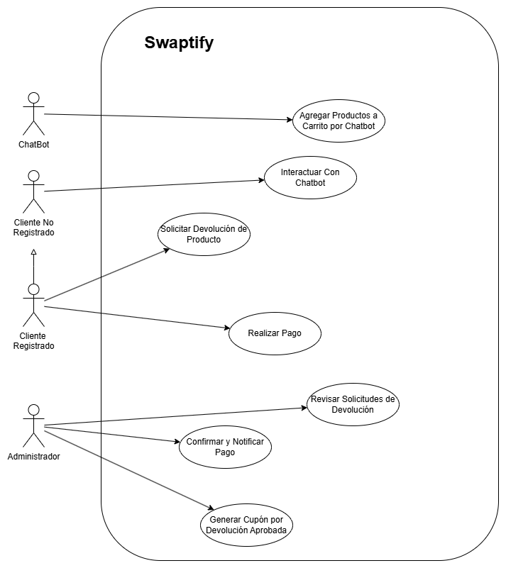
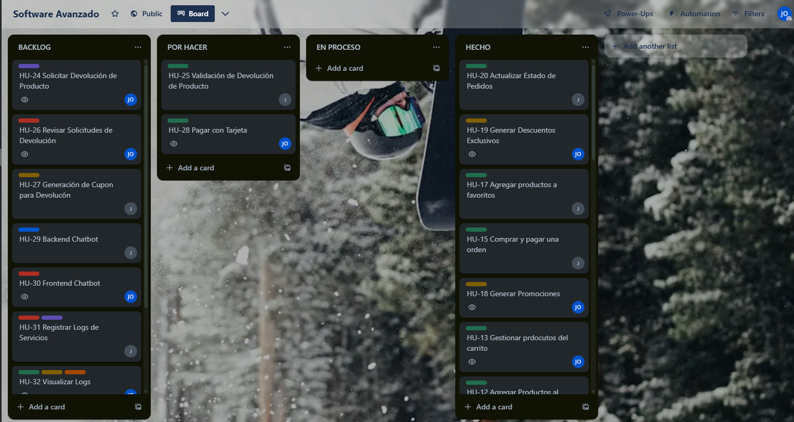
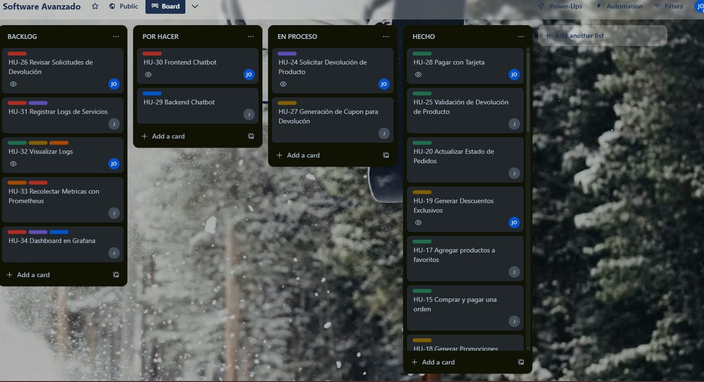
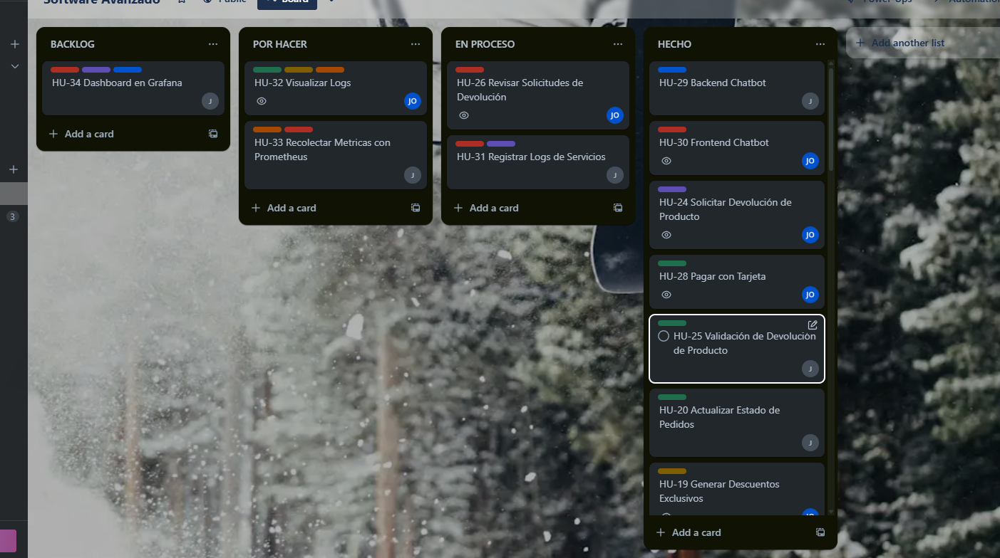
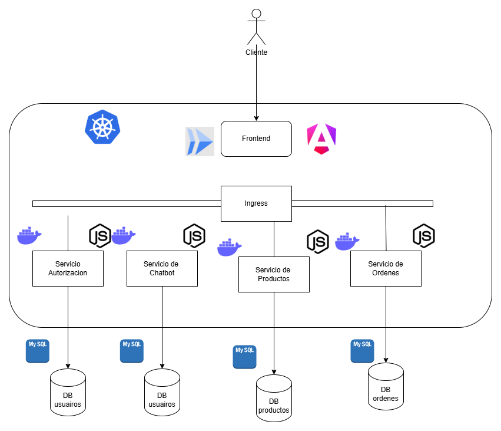
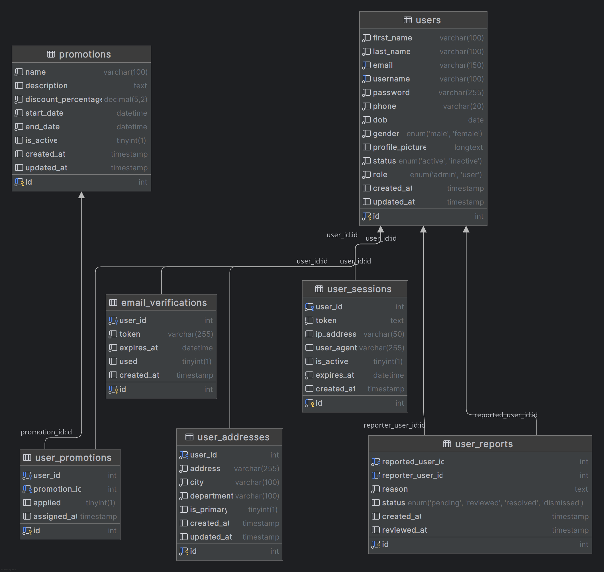
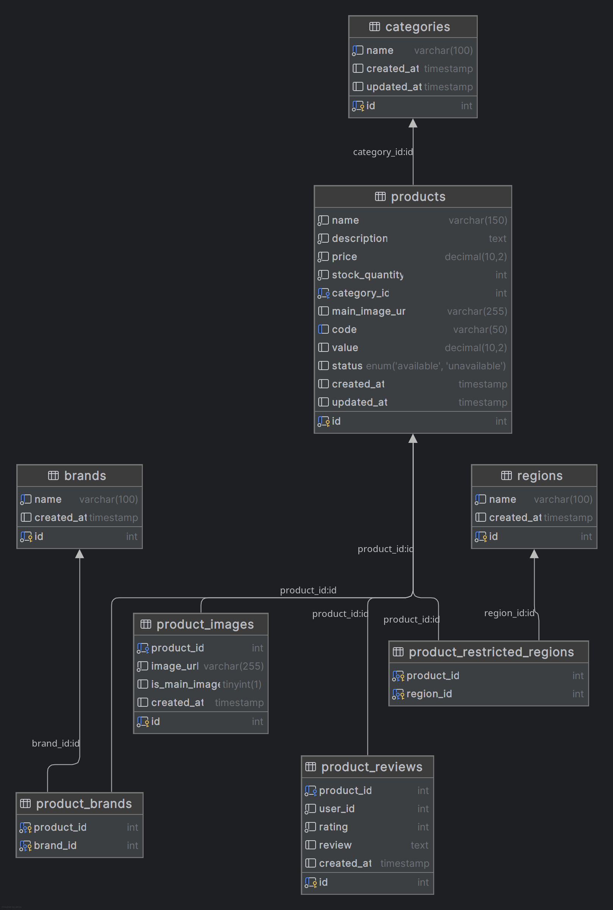
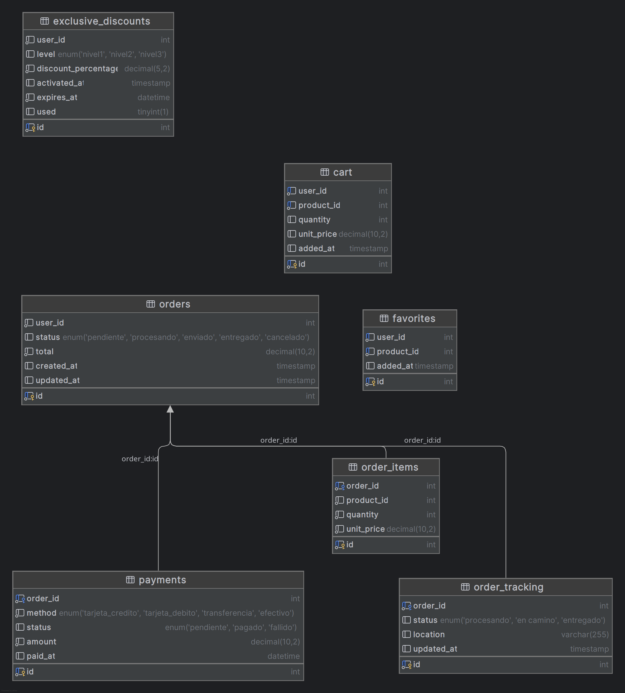

<h1 align="center"> PROYECTO FASE 2 </h1>

<p align="center">
  
</p>

*Universidad de San Carlos de Guatemala*  
*Escuela de Ingeniería en Ciencias y Sistemas, Facultad de Ingenieria*  
*Laboratorio de Software Avanzado Sección A, 1er. Semestre 2025.*  
___

### **Resumen**
Durante la Fase 3 del proyecto Swaptify, se enfocó la implementación en tres áreas clave: devoluciones, pagos y monitoreo del sistema. Se integraron y validaron funcionalidades críticas que fortalecen la experiencia del usuario y la operatividad de la plataforma en producción.

En cuanto a devoluciones (IX), se habilitó un módulo completo que permite a los usuarios solicitar la devolución de productos bajo condiciones específicas. Se estableció un flujo administrativo para validar cada solicitud, generando cupones de descuento en caso de aprobación.

En la sección de pagos (X), se implementaron métodos de pago seguros con tarjeta de crédito y débito, incluyendo la posibilidad de combinarlos en una misma transacción. Se integraron confirmaciones por correo y seguimiento del estado de los pedidos en tiempo real.

Finalmente, se desarrolló un robusto sistema de monitoreo y registro (XI) utilizando herramientas de la industria como Prometheus, Grafana y ELK Stack. Se configuraron dashboards para el análisis de métricas por microservicio y del clúster de Kubernetes. Además, se centralizaron y visualizaron los logs de los servicios, lo que facilita el diagnóstico y la mejora continua del sistema.

Con esta fase, el sistema no solo fortaleció su infraestructura de producción, sino que también dio un paso significativo hacia la operación estable, segura y escalable de la plataforma en un entorno de nube.

### **Requisitos** 
#### 💪 Funcionales

**RF09 – Solicitud de Devolución por el Usuario**
El sistema permitirá que el usuario solicite la devolución de productos desde su historial de compras, dentro de un plazo máximo de 30 días.

**RF10 – Validación de Condiciones de Devolución**
El sistema verificará que el producto no esté en descuento, no haya sido utilizado ni dañado para autorizar la devolución.

**RF11 – Devolución por Producto de Igual Valor**
Solo se permitirá el cambio por otro producto de igual valor como condición válida para completar una devolución.

**RF12 – Formulario de Solicitud de Devolución**
El sistema mostrará un formulario para que el usuario seleccione el producto, indique el motivo (opcional) y confirme la devolución.

**RF13 – Módulo de Gestión de Devoluciones para Administradores**
Habrá un módulo especializado al que solo podrán acceder usuarios con permisos administrativos, para aprobar o rechazar solicitudes de devolución.

**RF14 – Generación de Cupón por Devolución Aprobada**
Al aprobar una devolución, se generará automáticamente un cupón de descuento con el valor del producto devuelto, válido para futuras compras.

**RF15 – Pago con Tarjeta de Crédito o Débito**
El usuario podrá realizar pagos utilizando tarjeta de crédito o débito mediante pasarelas de pago seguras.

**RF16 – Pago Híbrido**
El sistema permitirá combinar dos métodos de pago (ej. una tarjeta de crédito + una de débito) para completar la transacción.

**RF17 – Confirmación de Compra y Seguimiento**
Una vez realizado el pago, se enviará un correo de confirmación con el resumen de la compra y un enlace para seguir el estado del pedido.

**RF18 – Registro de Logs de Microservicios**
Cada microservicio generará logs estructurados (mediante `winston` u otro logger) que serán enviados a Logstash y almacenados en Elasticsearch.

**RF19 – Visualización de Logs en Kibana**
Los logs del sistema podrán visualizarse en dashboards personalizados de Kibana para facilitar el análisis y troubleshooting.

**RF20 – Recolección de Métricas con Prometheus**
Se recolectarán métricas de uso, rendimiento y disponibilidad de cada microservicio con Prometheus.

**RF21 – Dashboards en Grafana por Microservicio**
Se configurarán dashboards en Grafana para visualizar métricas específicas por microservicio y del clúster de Kubernetes.

**RF22 – Configuración de Alertas en Prometheus**
Se habilitarán alertas en Prometheus basadas en umbrales críticos de uso de recursos (CPU, memoria, errores) para monitoreo proactivo.


#### ⭐ No Funcionales

**RNF01 – Disponibilidad**
El sistema debe garantizar un tiempo de actividad (uptime) mínimo del 99% en el entorno de producción, con monitoreo constante mediante Prometheus y alertas configuradas.

**RNF02 – Escalabilidad**
El sistema debe poder escalar automáticamente los microservicios cuando el uso de CPU o memoria supere el 80%, usando Kubernetes para la gestión de pods.

**RNF03 – Observabilidad**
Todos los microservicios deben generar logs estructurados que puedan ser visualizados y filtrados desde Kibana, permitiendo trazabilidad completa de las operaciones.

**RNF04 – Visualización de Métricas**
El sistema debe mostrar métricas clave de rendimiento (uso de CPU, memoria, tráfico HTTP, errores, etc.) mediante dashboards personalizados en Grafana.

**RNF05 – Mantenibilidad**
El sistema debe permitir actualizaciones continuas sin afectar la disponibilidad del servicio, utilizando pipelines CI/CD que automaticen despliegues de nuevas versiones.

**RNF06 – Seguridad en Transacciones**
Los pagos deben realizarse a través de métodos cifrados (HTTPS/TLS) y usando pasarelas de pago seguras. No se debe almacenar información sensible de tarjetas.

**RNF07 – Respaldo ante fallos**
La plataforma debe estar diseñada para tolerar fallos parciales sin afectar el resto del sistema, gracias al aislamiento de microservicios y la gestión de errores a través de logs.

**RNF08 – Rendimiento**
Cada microservicio debe responder en un tiempo menor a 500 ms para consultas comunes en condiciones normales de operación.

**RNF09 – Portabilidad**
El sistema debe ser fácilmente portable a diferentes entornos de nube, ya que todos los componentes están contenidos mediante Docker y orquestados por Kubernetes.

**RNF10 – Compatibilidad con herramientas de monitoreo**
El sistema debe estar completamente integrado con Prometheus, Grafana y ELK Stack, cumpliendo con los formatos y configuraciones necesarias para su funcionamiento.


### **Diagrama de Alto Nivel**
### **Casos De Uso**

**CU-AL01 – Gestión de Devoluciones**
**Actor:** Usuario, Administrador
**Descripción:** Permite a los usuarios solicitar la devolución de productos y a los administradores gestionar dichas solicitudes. Incluye validaciones, aceptación/rechazo y generación de cupones automáticos.

---

**CU-AL02 – Procesamiento de Pagos Seguros**
**Actor:** Usuario
**Descripción:** Gestiona el pago completo de los productos del carrito utilizando tarjetas de crédito o débito. Incluye la opción de combinar ambos métodos, confirmación de la transacción y notificación por correo electrónico.

---

**CU-AL03 – Supervisión de Microservicios y Recursos del Sistema**
**Actor:** Administrador del sistema / DevOps
**Descripción:** Centraliza la observación del comportamiento del sistema a través de métricas recolectadas con Prometheus, visualizadas en Grafana. Permite detectar problemas, uso excesivo de recursos y estados críticos.

---

**CU-AL04 – Análisis de Registros del Sistema**
**Actor:** Administrador del sistema / DevOps
**Descripción:** Permite la recolección, procesamiento y visualización de logs estructurados generados por los microservicios mediante ELK Stack. Facilita la auditoría, rastreo de errores y mejora del rendimiento.

---

**CU-AL05 – Generación de Alertas por Eventos del Sistema**
**Actor:** Sistema
**Descripción:** Detecta automáticamente condiciones anómalas en los servicios (alto consumo de recursos, errores, etc.) y dispara alertas configuradas en Prometheus, permitiendo una intervención temprana.

### **Diagramas de Casos De Uso**



| ID    | Nombre                             | Actor Principal        | Descripción                                                                                           |
| ----- | ---------------------------------- | ---------------------- | ----------------------------------------------------------------------------------------------------- |
| CU-24 | Solicitar devolución de producto   | Usuario registrado     | Permite al usuario solicitar la devolución de un producto desde su historial de compras.              |
| CU-25 | Validar condiciones de devolución  | Sistema                | Verifica que el producto no esté usado, dañado o en promoción antes de aceptar la devolución.         |
| CU-26 | Aprobar o rechazar devolución      | Administrador          | Permite al administrador revisar las solicitudes de devolución y decidir su aceptación.               |
| CU-27 | Generar cupón por devolución       | Sistema                | Genera un cupón de descuento equivalente al valor del producto devuelto si la devolución es aprobada. |
| CU-28 | Realizar pago con tarjeta          | Usuario registrado     | Permite al usuario completar el pago de su compra usando tarjeta de crédito o débito.                 |
| CU-29 | Realizar pago híbrido              | Usuario registrado     | Permite al usuario usar dos métodos de pago combinados (ej. crédito + débito).                        |
| CU-30 | Confirmar compra y enviar correo   | Sistema                | Envía un correo con el resumen de la compra y confirma el procesamiento del pago.                     |
| CU-31 | Registrar logs de eventos          | Sistema                | Registra automáticamente eventos del sistema y operaciones en los microservicios.                     |
| CU-32 | Visualizar logs en Kibana          | Administrador / DevOps | Permite consultar, filtrar y analizar los registros del sistema desde Kibana.                         |
| CU-33 | Recolectar métricas con Prometheus | Sistema                | Permite recolectar métricas de rendimiento y uso de los microservicios de forma automática.           |
| CU-34 | Visualizar métricas en Grafana     | Administrador / DevOps | Permite consultar métricas de uso y rendimiento mediante dashboards personalizados.                   |
| CU-35 | Generar alertas por umbral crítico | Sistema                | Dispara alertas configuradas si se detectan condiciones anómalas (ej. alto consumo de CPU).           |


### **Metodología Ágil Utilizada**

#### 📌 Metodología: **Scrum**
Para esta fase se aplicó la metodología ágil **Scrum**, la cual divide el desarrollo en ciclos iterativos llamados **sprints**, de duración fija. Se trabajó con planificación anticipada, asignación de tareas, revisión continua del progreso mediante un tablero Kanban y reuniones de retroalimentación al final de cada sprint para ajustar el rumbo del desarrollo.


#### 📋 Backlog del Proyecto

| ID    | Historia de Usuario                                                                    | Prioridad | Estimación |
| ----- | -------------------------------------------------------------------------------------- | --------- | ---------- |
| HU-24 | Como usuario, quiero solicitar la devolución de un producto desde mi historial         | Alta      | 1 día      |
| HU-25 | Como sistema, quiero validar si un producto cumple con las condiciones de devolución   | Alta      | 0.5 días   |
| HU-26 | Como administrador, quiero revisar solicitudes de devolución y aprobar o rechazar      | Alta      | 1 día      |
| HU-27 | Como sistema, quiero generar un cupón automáticamente cuando se aprueba una devolución | Media     | 0.5 días   |
| HU-28 | Como usuario, quiero pagar mis compras usando tarjeta de crédito o débito              | Alta      | 1 día      |
| HU-29 | Como usuario, quiero poder combinar tarjetas como método de pago híbrido               | Media     | 1 día      |
| HU-30 | Como sistema, quiero enviar una confirmación de compra por correo electrónico          | Alta      | 0.5 días   |
| HU-31 | Como sistema, quiero registrar logs de los microservicios para análisis posterior      | Alta      | 1 día      |
| HU-32 | Como DevOps, quiero visualizar los logs del sistema desde Kibana                       | Alta      | 0.5 días   |
| HU-33 | Como sistema, quiero recolectar métricas de uso y rendimiento con Prometheus           | Alta      | 1 día      |
| HU-34 | Como DevOps, quiero visualizar dashboards en Grafana por microservicio y clúster       | Alta      | 1 día      |
| HU-35 | Como sistema, quiero generar alertas si se detectan condiciones anómalas en métricas   | Alta      | 0.5 días   |

#### 🔁 División en sprints

Sprint 7 (Semana 7):

Sprint 8 (Semana 8):

Sprint 9 (Semana 9):


### Diagrama Arquitectura



### Diagrama ER de los microservicios

1. Auth-Service



2. Product-Service



3. Order Service



### Instalación y Configuración


#### 🟠 1. Prometheus

**Instalación**

Con Docker Compose

```yaml
version: '3'
services:
  prometheus:
    image: prom/prometheus
    volumes:
      - ./prometheus.yml:/etc/prometheus/prometheus.yml
    ports:
      - "9090:9090"
```

Con Helm Chart (Kubernetes)

```bash
helm repo add prometheus-community https://prometheus-community.github.io/helm-charts
helm install prometheus prometheus-community/prometheus
```

**Configuración Inicial**

Se creó un archivo `prometheus.yml` con lo siguiente:

```yaml
global:
  scrape_interval: 15s

scrape_configs:
  - job_name: 'swaptify-services'
    static_configs:
      - targets: 
          - 'user-service:3001'
          - 'product-service:3002'
          - 'payment-service:3003'

```

**Integración con el Sistema**
```js
const client = require('prom-client');
const register = client.register;

app.get('/metrics', async (req, res) => {
  res.set('Content-Type', register.contentType);
  res.end(await register.metrics());
});
```

#### 🟢 2. Grafana

**Instalación**

Con Docker Compose

```yaml
grafana:
  image: grafana/grafana
  ports:
    - "3000:3000"
  volumes:
    - grafana-storage:/var/lib/grafana
```

Con Helm en Kubernetes

```bash
helm repo add grafana https://grafana.github.io/helm-charts
helm install grafana grafana/grafana
```

**Configuración Inicial**

* Ingresar vía navegador: `http://localhost:3000` (usuario y contraseña por defecto: `admin`)
* Ir a *Data Sources* > *Add data source* > Seleccionar **Prometheus**
* URL: `http://prometheus:9090` (o IP correspondiente si está en Kubernetes)

---

#### 🔵 3. ELK Stack (Elasticsearch + Logstash + Kibana)

**Instalación**

```yaml
version: '3'
services:
  elasticsearch:
    image: docker.elastic.co/elasticsearch/elasticsearch:8.11.1
    environment:
      - discovery.type=single-node
    ports:
      - "9200:9200"

  logstash:
    image: docker.elastic.co/logstash/logstash:8.11.1
    ports:
      - "5044:5044"
    volumes:
      - ./logstash.conf:/usr/share/logstash/pipeline/logstash.conf

  kibana:
    image: docker.elastic.co/kibana/kibana:8.11.1
    ports:
      - "5601:5601"
```

**Configuración de Logstash (`logstash.conf`)**

```conf
input {
  tcp {
    port => 5044
    codec => json_lines
  }
}
output {
  elasticsearch {
    hosts => ["http://elasticsearch:9200"]
    index => "logs-swaptify"
  }
}
```

**Integración con el Sistema**

```js
const { createLogger, transports, format } = require('winston');
const logger = createLogger({
  format: format.json(),
  transports: [
    new transports.Console(),
    new transports.Http({
      host: 'logstash',
      port: 5044
    })
  ]
});

```

Tambien se utilizó Helm para instalar Prometheus y Grafana:

```bash
helm repo add prometheus-community https://prometheus-community.github.io/helm-charts
helm install prometheus prometheus-community/prometheus

helm repo add grafana https://grafana.github.io/helm-charts
helm install grafana grafana/grafana
```


### Guía de Usuario – Herramientas de Monitoreo y Registro


#### **Prometheus**

**Acceso**

* URL por defecto: `http://localhost:9090` (o la IP asignada en el entorno de producción).

#### Funciones principales

1. **Consultar métricas**:

   * Acceder a la pestaña **Graph**.
   * En la barra de búsqueda, escribir una métrica (por ejemplo: `http_requests_total`).
   * Hacer clic en **Execute** para visualizar los valores recolectados en tiempo real.

2. **Verificar endpoints monitoreados**:

   * Ir a **Status > Targets**.
   * En esta sección se pueden observar los microservicios que están siendo monitoreados, así como su estado (UP/DOWN).

3. **Explorar métricas disponibles**:

   * Ingresar a **Status > Metrics** para consultar todas las métricas recolectadas por Prometheus desde los microservicios.

4. **Visualizar reglas de alerta**:

   * Dirigirse a **Alerts** para observar las alertas definidas, su estado y condiciones de activación.

---

#### **Grafana**

**Acceso**

* URL por defecto: `http://localhost:3000`
* Usuario/Contraseña inicial: `admin / admin`

**Funciones principales**

1. **Agregar una fuente de datos (Prometheus)**:

   * Acceder a **Configuration > Data Sources**.
   * Seleccionar **Add data source** y elegir **Prometheus**.
   * Ingresar la URL del servidor Prometheus (`http://prometheus:9090`) y guardar.

2. **Crear un nuevo dashboard**:

   * Dirigirse a **Dashboards > New > New Dashboard**.
   * Seleccionar **Add Panel**.
   * Introducir una métrica (por ejemplo: `rate(http_requests_total[1m])`).
   * Elegir el tipo de gráfico deseado (líneas, barras, etc.).

3. **Guardar y reutilizar dashboards**:

   * Hacer clic en el icono de guardar.
   * El dashboard puede exportarse como archivo JSON o compartirse mediante un enlace.

4. **Crear alertas**:

   * Dentro de un panel, seleccionar la opción **Alert > Create Alert**.
   * Configurar la condición (por ejemplo, cuando la métrica supere cierto umbral).
   * Asociar la alerta a un canal de notificación (correo, Slack, etc.).

---

####  **Kibana (parte del ELK Stack)**

**Acceso**

* URL por defecto: `http://localhost:5601`

####  Funciones principales

1. **Crear un patrón de índice**:

   * Acceder a **Stack Management > Index Patterns**.
   * Crear un patrón como `logs-*`.
   * Seleccionar `@timestamp` como campo de tiempo principal.

2. **Explorar registros (logs)**:

   * Ingresar a **Discover**.
   * En esta sección se pueden observar en tiempo real los registros generados por los microservicios.
   * Aplicar filtros por campos como `log.level`, `service.name`, entre otros.

3. **Crear visualizaciones y dashboards**:

   * Dirigirse a **Visualize > Create visualization**.
   * Seleccionar el tipo de visualización deseado (gráfico de barras, líneas, etc.).
   * Escoger los datos relevantes desde los logs.
   * Agrupar visualizaciones dentro de un **Dashboard** para análisis más amplio.

4. **Filtrar errores específicos**:

   * Usar la barra de búsqueda para encontrar logs específicos. Por ejemplo:

     ```
     service.name:"order-service" AND log.level:"error"
     ```


### 🔍 Funcionalidades Clave de Monitoreo y Registro

#### **Prometheus**

**1. Recolección de métricas en tiempo real**
Prometheus permite recolectar métricas expuestas por los microservicios a través de endpoints `/metrics`, en formato compatible con el modelo de series temporales. Estas métricas incluyen:

* Cantidad de solicitudes HTTP (`http_requests_total`)
* Tiempos de respuesta (`http_request_duration_seconds`)
* Uso de CPU, memoria, número de conexiones, entre otros.

**2. Almacenamiento de series temporales**
Las métricas recolectadas se almacenan internamente, lo que permite consultas históricas y comparación de datos.

**3. Consultas con PromQL**
Prometheus cuenta con su propio lenguaje de consultas (**PromQL**), que permite filtrar, agrupar y calcular métricas complejas.

**4. Configuración de alertas**
Permite definir reglas de alerta basadas en condiciones lógicas sobre las métricas recolectadas.
Ejemplo:

```yaml
- alert: HighCPUUsage
  expr: rate(container_cpu_usage_seconds_total[1m]) > 0.8
  for: 1m
  labels:
    severity: warning
  annotations:
    summary: "Uso elevado de CPU en el servicio"
```


#### **Grafana**

**1. Creación de dashboards personalizados**
Grafana permite construir dashboards dinámicos para visualizar el estado de los microservicios mediante gráficas, tablas y tarjetas de estado. Cada panel se conecta a una fuente de datos (como Prometheus) y puede mostrar:

* Tráfico por segundo
* Tiempos de respuesta
* Porcentaje de errores por servicio
* Recursos consumidos (CPU, RAM, etc.)

**2. Paneles interactivos y reutilizables**
Los dashboards pueden ser reutilizados por el equipo, exportados en JSON o incrustados en otros sistemas. También admiten variables para permitir visualizaciones dinámicas según el servicio o entorno.

**3. Alertas desde los paneles**
Grafana permite crear alertas visuales directamente desde los paneles. Estas alertas se disparan cuando una métrica supera un umbral y pueden notificar automáticamente al equipo.


#### **Kibana**

**1. Centralización de registros**
Kibana, junto con Logstash y Elasticsearch, permite centralizar todos los registros generados por los microservicios en un solo punto de acceso, sin importar su lenguaje o ubicación.

**2. Visualización de logs en tiempo real**
La herramienta **Discover** de Kibana permite ver y filtrar logs de manera interactiva, lo que facilita la identificación de errores, advertencias o patrones anómalos.

**3. Creación de dashboards con datos de logs**
Es posible crear visualizaciones basadas en los datos de los logs, como:

* Frecuencia de errores por hora o día
* Servicios que generan más advertencias
* Cantidad de eventos por tipo de operación

**4. Búsquedas avanzadas**
Kibana permite ejecutar búsquedas complejas con operadores lógicos para encontrar registros específicos.
Ejemplo de búsqueda:

```
service.name:"auth-service" AND log.level:"error"
```


### Integración de Herramientas de Monitoreo y Registro con el Sistema

#### Prometheus

**Requisitos:**

* Cada microservicio expone un endpoint HTTP en `/metrics` que devuelva métricas en formato Prometheus.
* El uso de una librería de cliente compatible `prom-client`.

**Pasos de integración:**

1. **Instalar cliente Prometheus en los microservicios**

   ```bash
   npm install prom-client
   ```

2. **Instrumentar el código del microservicio**

   ```js
   const client = require('prom-client');
   const register = client.register;

   const httpRequestCounter = new client.Counter({
     name: 'http_requests_total',
     help: 'Número de solicitudes HTTP'
   });

   app.use((req, res, next) => {
     httpRequestCounter.inc();
     next();
   });

   app.get('/metrics', async (req, res) => {
     res.set('Content-Type', register.contentType);
     res.end(await register.metrics());
   });
   ```

3. **Agregar microservicios a `prometheus.yml`**

   ```yaml
   scrape_configs:
     - job_name: 'swaptify-microservices'
       static_configs:
         - targets: ['user-service:3001', 'payment-service:3002']
   ```

4. **Reiniciar Prometheus para aplicar cambios.**


#### Grafana

**Pasos de integración:**

1. **Ingresar a Grafana** (`http://localhost:3000`).
2. Ir a **Configuration > Data Sources > Add data source**.
3. Seleccionar **Prometheus** y establecer la URL:
   `http://prometheus:9090`
4. Crear dashboards personalizados para cada microservicio usando métricas expuestas:

   * Tasa de solicitudes (`rate(http_requests_total[1m])`)
   * Errores (`rate(http_requests_errors_total[1m])`)
   * Tiempo de respuesta promedio

---

#### ELK Stack 

**Pasos de integración:**

1. **Instalar librería de logging estructurado**:

   ```bash
   npm install winston
   ```

2. **Configurar el logger para enviar a Logstash**:

   ```js
   const { createLogger, format, transports } = require('winston');
   const logger = createLogger({
     format: format.json(),
     transports: [
       new transports.Console(),
       new transports.Http({
         host: 'logstash',
         port: 5044,
         path: '/',
       })
     ]
   });

   logger.info({ message: 'Usuario autenticado', service: 'auth-service' });
   ```

3. **Configurar Logstash para recibir y enviar a Elasticsearch** (`logstash.conf`):

   ```conf
   input {
     tcp {
       port => 5044
       codec => json_lines
     }
   }
   output {
     elasticsearch {
       hosts => ["http://elasticsearch:9200"]
       index => "logs-swaptify"
     }
   }
   ```

4. **Verificar logs desde Kibana**:

   * Acceder a `http://localhost:5601`.
   * Crear un índice con patrón `logs-*`.
   * Visualizar logs desde la pestaña **Discover**.


